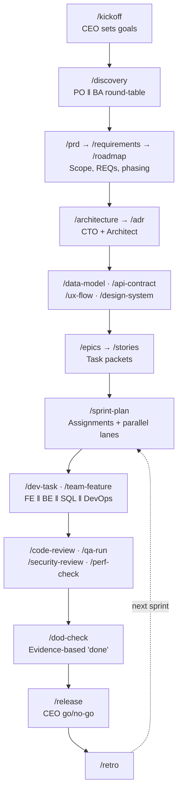

<div align="center">

# 🏢 Claude Code App Studio

**A virtual software company that takes your application from idea to release.**

19 specialized agents. 38 workflows. 16 quality gates.
From CEO to test engineer — the way a real software organization actually works.

[](https://claude.com/claude-code)
[](.claude/agents)
[](.claude/skills)
[](.claude/docs/gates.md)
[](LICENSE)

[Quick Start](#-quick-start) · [How It Works](#-how-it-works) · [Roles](#-the-team) · [Token Control](#-token-control) · [Commands](#-command-reference)

</div>

---

## What is this?

You describe a project in one sentence. A full software organization picks it up.

```
/kickoff "Inventory and invoicing app for small businesses"
```

The **CEO** turns it into measurable business goals and draws the MVP boundary.
The **Product Owner** and **Business Analyst** then work in parallel — one through a
value lens, the other hunting for gaps and contradictions — and hand you every
disagreement as a decision to make. The **Solution Architect** and **CTO** pick the
stack and write the ADRs. **UX** and **UI** design the flows and the design system.
The **Delivery Manager** breaks the work into epics, stories and sprint assignments.
Then **frontend, backend, SQL and DevOps** engineers build it in coordinated parallel
lanes, while **QA, code review, security and performance** hold the quality gates.

> **This is not autopilot.** Every agent presents options with trade-offs, shows drafts,
> and asks for approval before writing. You are the founder — you make the calls.

---

## ⚡ Quick Start

```bash
git clone https://github.com/bturksoy/claude-code-app-studio my-project
```

```bash
cd my-project && rm -rf .git && git init
```

Then, in Claude Code:

```
/start
```

That's it. `/start` detects the state and tells you the single next step.

**Brand new project?**

```
/kickoff "<your idea in one sentence>"
```

**Existing codebase?**

```
/onboard
```

---

## 🔄 How It Works



### The two ideas that make it work

**1. The round-table.** `/discovery` runs the Product Owner and Business Analyst
**in parallel, blind to each other**. The PO looks at value and priority; the BA hunts
for ambiguity — *"could two different systems be built from this definition?"* Their
outputs get sorted into **agreement**, **contradiction** and **open question**.
Contradictions become decisions you answer, not guesses an agent makes.

**2. The task packet.** A story file is **self-sufficient**. It carries its acceptance
criteria, the governing ADR's implementation guidance, the relevant API and schema
fragments, and the exact file paths to touch — all copied in. The developer agent reads
**one file instead of eight**. This is where most of the token savings come from, and it
is why `/stories` is deliberately the most expensive step in the pipeline.

---

## 👥 The Team

<table>
<tr><th align="left">Tier</th><th align="left">Roles</th><th align="left">Model</th></tr>
<tr>
<td><b>Executive</b></td>
<td><code>ceo</code> · <code>cto</code></td>
<td>opus</td>
</tr>
<tr>
<td><b>Product &amp; Planning</b></td>
<td><code>product-owner</code> · <code>business-analyst</code> · <code>solution-architect</code> · <code>delivery-manager</code></td>
<td>opus / sonnet</td>
</tr>
<tr>
<td><b>Design</b></td>
<td><code>ux-designer</code> · <code>ui-designer</code></td>
<td>sonnet</td>
</tr>
<tr>
<td><b>Engineering</b></td>
<td><code>frontend-developer</code> · <code>backend-developer</code> · <code>sql-developer</code> · <code>data-engineer</code> · <code>devops-engineer</code></td>
<td>sonnet</td>
</tr>
<tr>
<td><b>Quality</b></td>
<td><code>qa-lead</code> · <code>test-engineer</code> · <code>code-reviewer</code> · <code>security-engineer</code> · <code>performance-engineer</code></td>
<td>opus / sonnet</td>
</tr>
<tr>
<td><b>Support</b></td>
<td><code>tech-writer</code></td>
<td>haiku</td>
</tr>
</table>

Every role has a **read budget**, a **write scope** and an explicit list of things it
must *not* do. A developer consumes the API contract; it cannot change it. A security
engineer reports findings; it cannot edit application code. Disagreements escalate
along a defined path instead of being silently resolved.

→ [Full roster and authority matrix](.claude/docs/agent-roster.md)

---

## 🚪 Quality Gates

Every phase ends with a gate. The responsible agent answers with a single verdict token:

```
ARCH-DESIGN: APPROVED
CR-CODE: CONDITIONAL
QA-DONE: REJECTED
```

There are 16 of them — `CEO-VISION`, `PO-SCOPE`, `BA-REQ`, `CTO-STACK`, `ARCH-DESIGN`,
`SEC-THREAT`, `UX-FLOW`, `DM-PLAN`, `ARCH-STORY`, `CR-CODE`, `QA-DONE`, `SEC-REVIEW`,
`PERF-BUDGET`, `OPS-READY`, `CEO-GONOGO`, `QA-TESTABLE`.

The `QA-DONE` gate is the strict one: **no evidence, no approval.** "The tests pass" is
not evidence — test output is. Each story type has its own mandatory proof:

| Story type | Required evidence |
|---|---|
| Logic | Passing unit test bound to each `AC-N` |
| Integration | Integration test + contract conformance |
| Data | Migration `up → down → up` verified |
| UI | Component test or a signed-off evidence file |
| Infra | Green pipeline output + written rollback |

→ [Gate catalogue](.claude/docs/gates.md) · [Definition of Done](.claude/docs/definition-of-done.md)

---

## 💰 Token Control

Multi-agent systems get expensive fast. This one is built to be tuned.

### Three dials

**1. Review mode** — `product/review-mode.txt`

| Mode | Gates | Overhead | Use for |
|---|---|---|---|
| `solo` | none | +0% | Personal projects, prototypes |
| `lean` | phase transitions | +20% | **Default** — most projects |
| `full` | all 16 | +60% | Enterprise, regulated, critical systems |

**2. Project scale** — chosen during `/kickoff`, narrows the roster

`Prototype` runs 5 roles. `Standard` runs 14. `Enterprise` runs all 19.

**3. Task packet discipline** — the big one

A well-written story means the developer agent reads 1 file, not 8. `/assign` exists
purely to complete a story's packet **before** `/dev-task` touches it.

### Built-in cost discipline

- **Model tiering** — `opus` only for ambiguous strategic work, `haiku` for mechanical work
- **Read budgets** — 3 files for executives, 8 for engineers; exceeding one stops the agent
- **Free skills** — `/status`, `/start`, `/assign` and `/handoff` invoke no agents at all
- **Conditional invocation** — `/qa-run` calls no agent if every test passes
- **Grep pre-filters** — `/security-review` narrows the search before the agent ever runs
- **Structured returns** — subagents return `VERDICT / SUMMARY / FINDINGS`, never transcripts
- **Self-monitoring** — `/status` flags it when a sprint exceeds 30 agent calls

→ [Token budget protocol](.claude/docs/token-budget.md)

---

## 📖 Command Reference

<details>
<summary><b>Bootstrap</b></summary>

| Command | What it does |
|---|---|
| `/start` | State detection + next step |
| `/kickoff "<idea>"` | Start a new project |
| `/onboard` | Bring an existing codebase into the system |
| `/status` | Project status dashboard |
| `/help` | Command list, filtered by phase |

</details>

<details>
<summary><b>Phase 1 — Discovery &amp; Requirements</b></summary>

| Command | What it does |
|---|---|
| `/discovery` | PO + BA round-table: problem, personas, scope |
| `/roundtable "<topic>"` | Multi-role discussion on any topic |
| `/prd` | Product requirements document |
| `/requirements` | FRD + NFR + data dictionary |
| `/roadmap` | Phasing and release plan |
| `/estimate` | Effort estimation with uncertainty bands |
| `/scope-check` | Scope-creep detection and cut order |

</details>

<details>
<summary><b>Phase 2 — Architecture &amp; Design</b></summary>

| Command | What it does |
|---|---|
| `/architecture` | Architecture + technology stack |
| `/adr "<topic>"` | Architecture decision record |
| `/api-contract` | OpenAPI contract |
| `/data-model` | ER + schema + migration plan |
| `/ux-flow` | Personas, flows, wireframe specs |
| `/design-system` | Tokens + component catalogue |
| `/threat-model` | STRIDE security threat model |

</details>

<details>
<summary><b>Phase 3 — Planning &amp; Development</b></summary>

| Command | What it does |
|---|---|
| `/epics` | Value-based epic breakdown |
| `/stories <epic>` | Task packets |
| `/sprint-plan` | Assignments + parallel lanes |
| `/assign <story>` | Route and complete a story before work starts |
| `/dev-task <story>` | Implement one story |
| `/team-feature <epic>` | Full-team vertical slice |
| `/handoff` | Handoff packet between agents |

</details>

<details>
<summary><b>Phase 4 — Quality</b></summary>

| Command | What it does |
|---|---|
| `/code-review [scope]` | Independent review with severity-ranked findings |
| `/test-plan` | Risk-based test strategy and plan |
| `/qa-run [scope]` | Run tests, classify failures, file bugs |
| `/bug "<description>"` | Bug record + triage |
| `/security-review` | OWASP checks + threat verification |
| `/perf-check` | Performance budgets |
| `/dod-check <story>` | The evidence-based "done" gate |

</details>

<details>
<summary><b>Phase 5 — Release &amp; Operate</b></summary>

| Command | What it does |
|---|---|
| `/release <version>` | Release plan, rollback, go/no-go |
| `/changelog` | Keep a Changelog entry |
| `/hotfix "<issue>"` | Emergency fix path |
| `/retro` | Retrospective with real numbers |
| `/context-compact` | Compact docs, refresh indexes, save tokens |

</details>

---

## 📁 What Gets Produced

```
product/                     Business layer
├── 00-brief.md              Goals (GOAL-*), success metrics, MVP boundary
├── prd/PRD.md               Scope, capabilities, priorities
├── requirements/            FRD (REQ-*), NFR (NFR-*), data dictionary
├── roadmap/                 Phases with measurable exit criteria
├── backlog/epics/           Epics → stories (task packets)
└── sprints/                 Assignments, lanes, risks, retros

docs/                        Technical layer
├── CONTEXT.md               ★ The project brain — every agent reads this first
├── DECISIONS.md             Append-only decision log
├── architecture/            ARCHITECTURE.md + ADRs
├── api/openapi.yaml         ★ API single source of truth
├── data/ER.md               Entity model
├── design/                  UX flows + design system
├── qa/                      Strategy, test cases, evidence, bugs
├── security/                Threat model + OWASP results
└── ops/                     Environments, runbook, release plans
```

★ marks a **single source of truth** — referenced, never copied. (Stories are the one
deliberate exception, and `/context-compact` audits them for drift.)

---

## 🛠 Customization

| You want to | Do this |
|---|---|
| Add or remove a role | Add a `.md` to `.claude/agents/`, update `agent-roster.md` |
| Add a workflow | Create `.claude/skills/<name>/SKILL.md` |
| Change coding standards | Edit the relevant file in `.claude/rules/` |
| Change document formats | Edit `.claude/templates/` |
| Add an automated check | Edit `.claude/hooks/` + `settings.json` |
| Loosen or tighten review | Edit `product/review-mode.txt` |

The 8 rule files in `.claude/rules/` are path-scoped — `backend-code.md` applies to
`src/backend/**`, `database.md` to `db/**`, and `security.md` overrides all of them.
Code review and `/dev-task` embed the relevant rules directly into the agent's prompt.

---

## 🧭 Design Principles

- **Single source of truth** — one fact, one file, referenced everywhere else
- **Traceability** — `story → REQ → GOAL` never breaks; unlinked work does not get built
- **No done without evidence** — every story type has a mandatory proof
- **Stay in your lane** — agents escalate instead of deciding outside their domain
- **The user decides** — agents present options and ask before writing
- **Contracts before code** — the API and schema freeze before implementation starts
- **The simplest thing that works** — a distributed system needs a justification, not a preference

---

## ☕ Support

If this saves you time, you can buy me a coffee:

<a href="https://buymeacoffee.com/bturksoy">
  
</a>

---

## 🙏 Credits

Inspired by [claude-code-game-studios](https://github.com/donchitos/claude-code-game-studios),
which applies the same idea to game development.

Built for [Claude Code](https://claude.com/claude-code).

---

<div align="center">
<sub>Issues and pull requests welcome.</sub>
</div>
